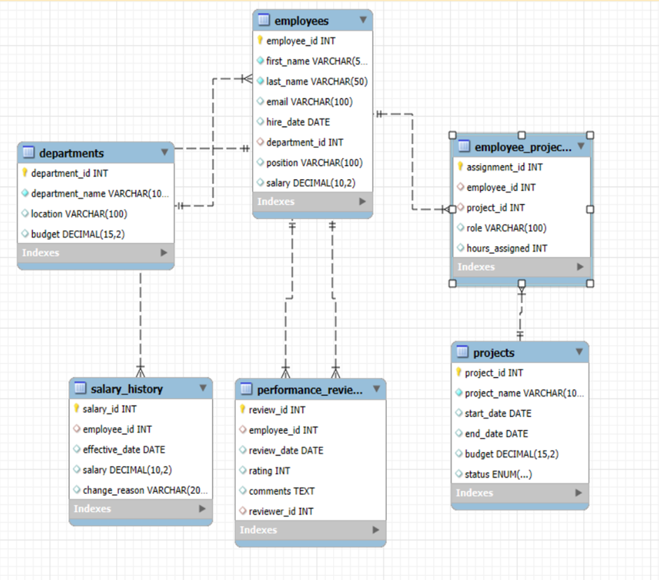

# Employee Management System – SQL Analytics Project

## Overview
This project is a comprehensive **Employee Management System** built using **MySQL**, designed to store, manage, and analyze organizational workforce data.  
The system goes beyond basic CRUD operations and focuses on **data-driven analysis** to extract meaningful business insights related to employees, departments, projects, salaries, and performance.

The primary goal of this project is to demonstrate **intermediate-to-advanced SQL skills** through real-world analytical queries and structured relational database design.

---

## Database Schema
The database consists of **six interconnected tables**, forming a normalized relational structure:

- **employees** – Stores employee details such as name, role, salary, hire date, and department.
- **departments** – Contains department-level information including budget and location.
- **projects** – Maintains project details like budget, timeline, and status.
- **employee_projects** – A junction table mapping employees to projects with assigned working hours.
- **salary_history** – Tracks historical salary changes with effective dates and reasons.
- **performance_reviews** – Records employee performance ratings, feedback, and review dates.

This schema enables complex analytical queries using joins, aggregations, and window functions.

---

## Entity Relationship Diagram (ERD)
The ERD illustrates the relationships between employees, departments, projects, and performance data, ensuring data integrity and efficient querying.

---

## Key Analyses Performed

### 1. Departmental Overview & Financial Efficiency
- Department-wise employee count and budget allocation
- Salary expenditure vs departmental budget
- Average salary and employee tenure by department

**Insights:**  
Identifies budget imbalances, high-cost departments, and experience concentration.

---

### 2. Workforce Performance & Compensation
- Distribution of performance ratings
- Average salary by performance rating
- Correlation between latest performance rating and current salary

**Insights:**  
Helps detect rating inflation, underpaid high performers, and compensation inconsistencies.

---

### 3. Project Management & Resource Utilization
- Project status, budget, and duration analysis
- Employee workload analysis based on assigned hours
- Cross-department collaboration across projects

**Insights:**  
Highlights burnout risks, underutilized employees, and collaboration patterns.

---

### 4. Historical Trends & Tenure Analysis
- Year-wise hiring trends
- Employee distribution by tenure groups
- Departments with the most experienced workforce

**Insights:**  
Provides understanding of organizational growth, stability, and retention patterns.

---

## SQL Techniques Used
- Multi-table `JOIN`s
- Aggregation functions (`SUM`, `AVG`, `COUNT`)
- `GROUP BY` and `ORDER BY`
- Common Table Expressions (CTEs)
- Window functions (`ROW_NUMBER`)
- Date-based calculations for tenure and trends

---

## Tools & Technologies
- **Database:** MySQL  
- **Query Language:** SQL  
- **Design:** ER Modeling  
- **Analysis Type:** Workforce & Business Analytics  

---

## How to Use
1. Create a database in MySQL.
2. Import the provided `.sql` file.
3. Execute analysis queries from the report or `queries` folder.
4. Review outputs to understand business insights.

---

## Project Use Cases
- Workforce planning and optimization
- Budget and salary analysis
- Performance-based compensation review
- Project resource allocation

---

## Conclusion
This project demonstrates how a well-structured relational database combined with analytical SQL queries can transform raw employee data into **actionable business insights**.  
It reflects practical SQL usage aligned with real-world organizational decision-making scenarios.

---

## 👤 Author

**Shivam Singh**
Aspiring Data Scientist | Machine Learning Enthusiast

🔗 GitHub: [https://github.com/shivamsingh-itds]
🔗 LinkedIn: [www.linkedin.com/in/shivamsinghds]

---

⭐ If you find this project helpful, feel free to star the repository!